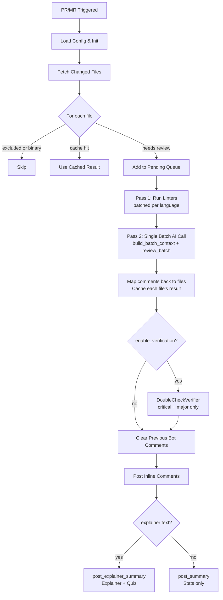

# Architecture Documentation

## Overview

AI Code Reviewer is built on a modular architecture with a linter-first, batch AI review pipeline and optional 2-pass verification for high-severity findings.

## Directory Structure

```text
ai-reviewer/
├── src/
│   ├── core/                       # Business logic
│   │   ├── config.py              # Configuration management
│   │   ├── cache.py               # File-based caching
│   │   └── reviewer.py            # Main review orchestrator
│   │
│   ├── adapters/                   # External service adapters
│   │   ├── base.py                # Abstract base classes
│   │   ├── gitlab_adapter.py      # GitLab API integration
│   │   ├── github_adapter.py      # GitHub API integration
│   │   └── openrouter_provider.py # OpenRouter AI provider
│   │
│   ├── analyzers/                  # Code analysis
│   │   ├── language_detector.py   # Language & framework detection
│   │   └── context_builder.py     # Batch context builder
│   │
│   ├── tools/                      # Pluggable analysis tools
│   │   ├── base.py                # Tool interface (Tool, ToolResult)
│   │   ├── registry.py            # Tool registry & executor
│   │   ├── linter.py              # Language-specific linter runner
│   │   ├── file_reader.py         # File content reader tool
│   │   └── git_history.py         # Git commit history tool
│   │
│   ├── verification/              # 2-pass verification
│   │   └── verifier.py            # DoubleCheckVerifier
│   │
│   └── utils/
│       ├── file_utils.py          # File operations
│       └── timer.py               # Step timing utility
│
├── main_gitlab.py                  # GitLab CI entry point
├── main_github.py                  # GitHub Actions entry point
└── requirements.txt
```

## Review Pipeline

The reviewer runs three sequential phases per PR:



## Module Descriptions

### `src/core/reviewer.py` — CodeReviewer

Main orchestrator. On `review_pull_request(pr_id)`:

1. Fetches changes from platform adapter
2. Filters excluded/binary/oversized files
3. Checks cache — skips API call for cached files
4. Groups remaining files into `pending_items`
5. Runs `_run_batched_linters()` — one subprocess per language group
6. Calls `context_builder.build_batch_context()` then `ai_provider.review_batch()` — **one API call for all files**
7. Maps AI comments back to individual files, caches each
8. Optionally runs `DoubleCheckVerifier` on critical/major issues
9. Posts inline comments and an explainer summary to the platform

Key constructor flag: `enable_verification=True` (default) wires up the full tool registry and verifier.

Cache version key: `"v6-linter-first"` when verification is enabled, `"v3"` otherwise.

### `src/core/config.py` — ConfigLoader

Loads `.ai-review-config.json` and merges with defaults.

```python
config = ConfigLoader()
config.get_model()          # → "z-ai/glm-4.5-air" (default)
config.get_exclusions()     # → {directories, file_prefixes, file_patterns}
config.get_cache_settings() # → {cache_location, ttl_days}
```

### `src/core/cache.py` — CacheManager

MD5-based, file-backed cache with TTL expiration.

```python
cache = CacheManager(cache_dir=".review_cache", ttl_days=7)
key = cache.get_cache_key(f"{filepath}:{diff}:v6-linter-first")
cached = cache.get(key)
cache.set(key, comments)
```

### `src/adapters/openrouter_provider.py` — OpenRouterProvider

Three API methods:

| Method | Purpose | Returns |
| --- | --- | --- |
| `review(context)` | Single-file review (legacy) | `List[Dict]` comments |
| `review_batch(batch_context)` | All-files-in-one-call review | `{comments, explainer}` |
| `verify_issue(prompt)` | Re-verify one issue with evidence | `{confirmed, reasoning, updated_severity}` |

Default model: `z-ai/glm-4.5-air`. Any OpenRouter-hosted model works via config.

### `src/adapters/base.py` — Abstract Interfaces

`PlatformAdapter` requires: `get_changes`, `post_comments`, `post_summary`, `post_explainer_summary`, `clear_bot_comments`.

`AIProviderAdapter` requires: `review`, `review_batch`, `test_connection`.

### `src/analyzers/context_builder.py` — ContextBuilder

`build_batch_context(pending_items, all_pr_filepaths)` builds a single prompt string covering all pending files. Each item's linter results are embedded inline. Also fetches README and Dockerfile for project-level context.

### `src/analyzers/language_detector.py` — LanguageDetector

Extension-based language detection with content-based framework detection. Supports 15+ languages and drives linter selection.

### `src/tools/linter.py` — LinterTool

Runs the appropriate static analysis tool for a language. Key feature: filters output to only the changed line numbers, keeping AI context lean.

Supported linters:

| Language | Primary | Fallback |
| --- | --- | --- |
| Python | pylint (JSON) | flake8 |
| JavaScript | eslint (JSON) | — |
| TypeScript | eslint (JSON) | — |
| Dart | dart analyze (JSON) | — |
| Go | golangci-lint (JSON) | go vet |
| Rust | cargo clippy (JSON) | — |
| Java | checkstyle (JSON) | — |
| PHP | phpcs (JSON) | php -l |

`execute_batch(files, language)` runs one subprocess for all files of that language, minimizing process overhead.

### `src/tools/registry.py` — ToolRegistry

Registers tools by name and dispatches `execute_tool(name, **kwargs)`. Returns a `ToolResult(success, data, error)`.

### `src/tools/base.py` — Tool / ToolResult

Abstract `Tool` base class with `name`, `description`, `parameters`, and `execute(**kwargs)` / `execute_batch(...)`.

### `src/verification/verifier.py` — DoubleCheckVerifier

Runs only on `critical` and `major` severity issues. For each:

1. Uses cached linter results (from Pass 1) to check if the linter flagged the same line
2. Reads git history of the file (up to 3 commits)
3. Reads any related files mentioned in the issue text
4. Marks issues as `linter_confirmed: true/false`

Minor/suggestion issues bypass verification and pass through unchanged.

## Design Patterns

### Adapter Pattern

Platform and AI providers implement abstract interfaces. Swap GitHub ↔ GitLab without touching the reviewer.

### Dependency Injection

```python
reviewer = CodeReviewer(
    platform_adapter=platform,
    ai_provider=ai_provider,
    context_builder=context_builder,
    enable_verification=True
)
```

### Tool Registry (Plugin Pattern)

```python
registry = ToolRegistry()
registry.register(LinterTool())
registry.register(FileReaderTool())
result = registry.execute_tool("run_linter", filepath="src/foo.py", language="python")
```

### Strategy Pattern

`LanguageDetector` drives both linter selection and context-building prompt strategy.

## Configuration

### Minimal

```json
{
  "enabled": true,
  "model": "z-ai/glm-4.5-air"
}
```

### Full

```json
{
  "enabled": true,
  "model": "z-ai/glm-4.5-air",
  "max_tokens": null,
  "temperature": 0.3,
  "exclusions": {
    "directories": ["node_modules", "vendor", "build"],
    "file_patterns": ["*.lock", "*.min.js"],
    "file_prefixes": ["test_"]
  },
  "cache_settings": {
    "cache_location": ".review_cache",
    "ttl_days": 7
  },
  "review_settings": {
    "severity_threshold": "minor",
    "max_comments_per_file": 10
  }
}
```

## Extending the System

### Add a New Platform (e.g., Bitbucket)

```python
# src/adapters/bitbucket_adapter.py
from .base import PlatformAdapter

class BitbucketAdapter(PlatformAdapter):
    def get_changes(self, pr_id): ...
    def post_comments(self, pr_id, comments): ...
    def post_summary(self, pr_id, stats, comments): ...
    def post_explainer_summary(self, pr_id, explainer, stats, comments): ...
    def clear_bot_comments(self, pr_id): ...
```

### Add a New AI Provider

```python
# src/adapters/claude_provider.py
from .base import AIProviderAdapter

class ClaudeProvider(AIProviderAdapter):
    def review(self, context): ...
    def review_batch(self, batch_context): ...
    def test_connection(self): ...
```

### Add a New Language to the Linter

Update `LinterTool.LINTER_COMMANDS` in `src/tools/linter.py`:

```python
'scala': {
    'command': ['scalastyle', '--format=json'],
    'check_installed': 'scalastyle --version'
}
```

Then update `LanguageDetector` extension map in `src/analyzers/language_detector.py`.

### Add a New Tool

```python
# src/tools/my_tool.py
from .base import Tool, ToolResult

class MyTool(Tool):
    @property
    def name(self): return "my_tool"

    def execute(self, **kwargs) -> ToolResult:
        ...
        return ToolResult(success=True, data={...})
```

Register it in `reviewer.py`:

```python
self.tool_registry.register(MyTool())
```

## Version Notes

- **v3** (cache key): pre-linter single-file review
- **v6-linter-first** (cache key): current — linter-first batch pipeline
- Last architecture update: 2026-07-27
