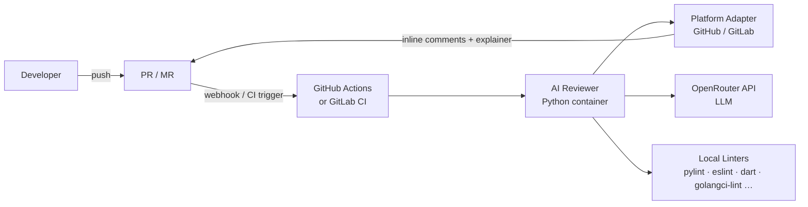
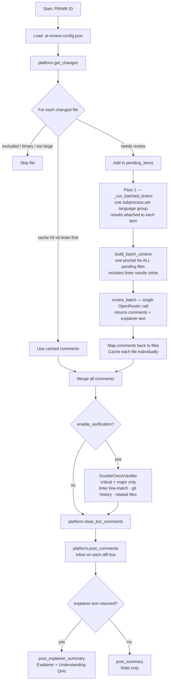
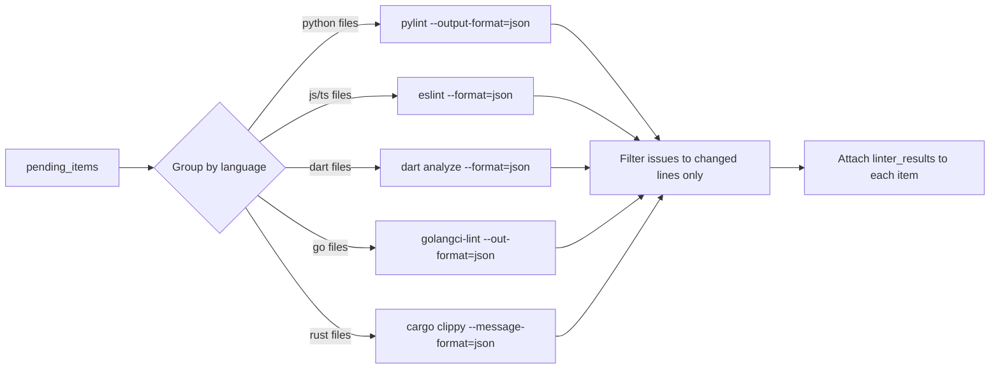
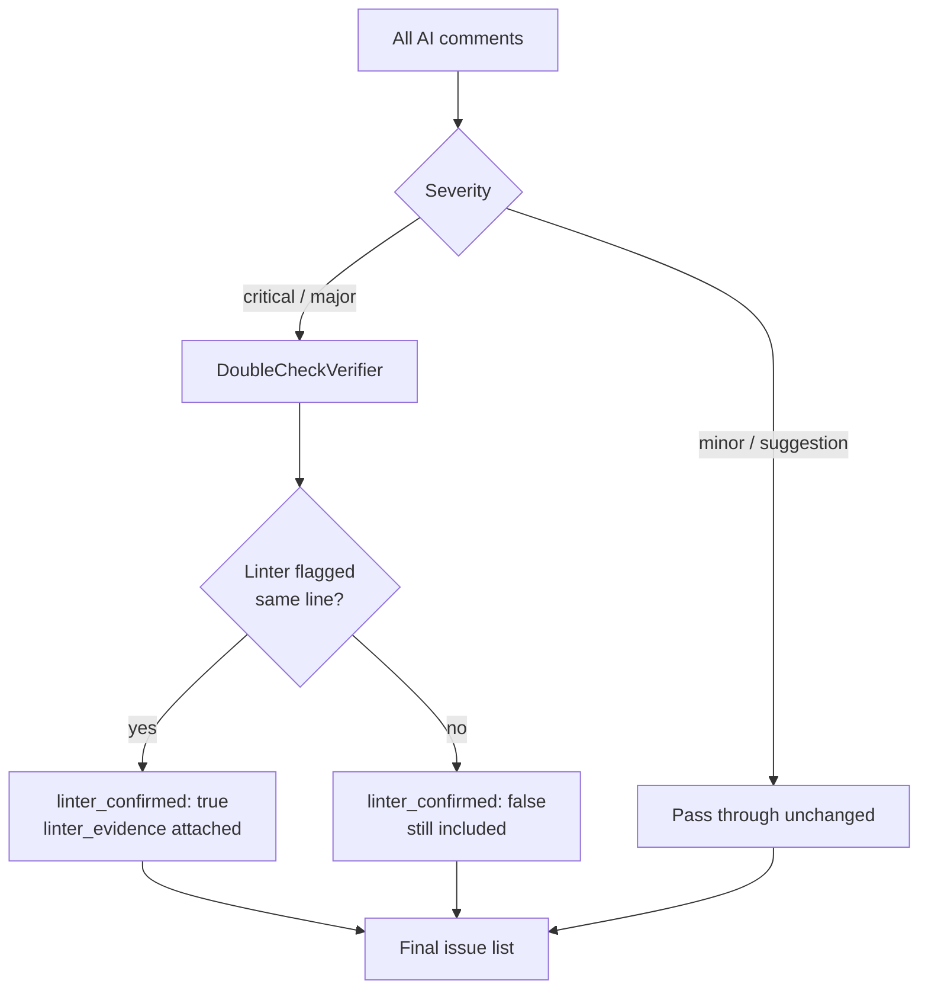
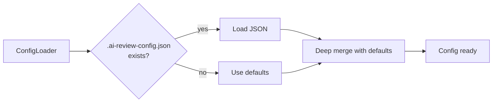
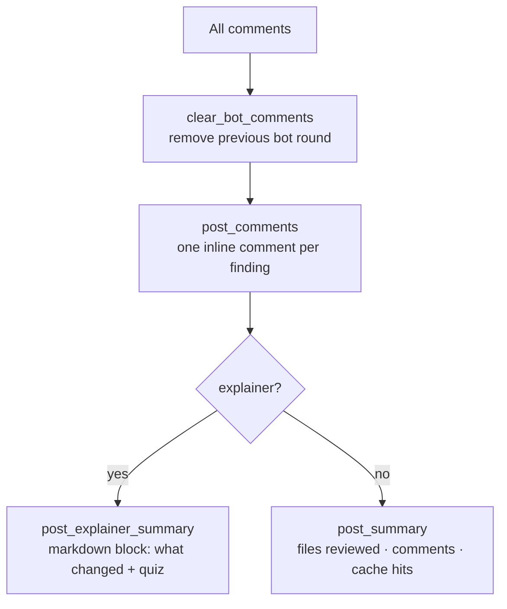

# System Flow

## High-Level Architecture



## End-to-End Review Flow



## Pass 1 — Linter Batching



One subprocess per language — not one per file. If a linter is not installed, that language group is skipped gracefully.

## Pass 2 — Batch AI Review

All pending files are sent in a single API call. The response is a JSON object:

```json
{
  "comments": [
    {
      "filepath": "src/auth.py",
      "line": 42,
      "severity": "critical",
      "message": "SQL query is not parameterised",
      "suggestion": "Use db.execute(query, params) instead"
    }
  ],
  "explainer": "## What changed in this PR\n..."
}
```

Comments are mapped back to individual files. Each file's comments are cached separately so partial cache hits work on the next run.

## Verification Flow



Verification never removes issues — it enriches them with `linter_confirmed` metadata so reviewers know which findings have static-analysis backing.

## Caching Strategy

Cache key: `MD5(filepath + diff + version_string)`

- Version `v6-linter-first` — current pipeline (linter + batch AI)
- Version `v3` — legacy (no linter, per-file AI)

A cache miss on one file does not invalidate others. Stale entries expire after `ttl_days` (default 7).

## Configuration Loading



## File Filtering

Applied before any linting or AI call:

1. Hardcoded: skip `.ai-review-config*.json` itself
2. Config `exclusions.directories` — path contains excluded dir
3. Config `exclusions.file_prefixes` — filename starts with prefix
4. Config `exclusions.file_patterns` — glob match on filename or path
5. Binary flag from platform diff API
6. Diff length > 10 000 chars

## Comment Posting



The explainer is a markdown block posted as a single PR-level comment, separate from inline findings. It includes a short description of what changed and a quiz to help reviewers confirm understanding.
