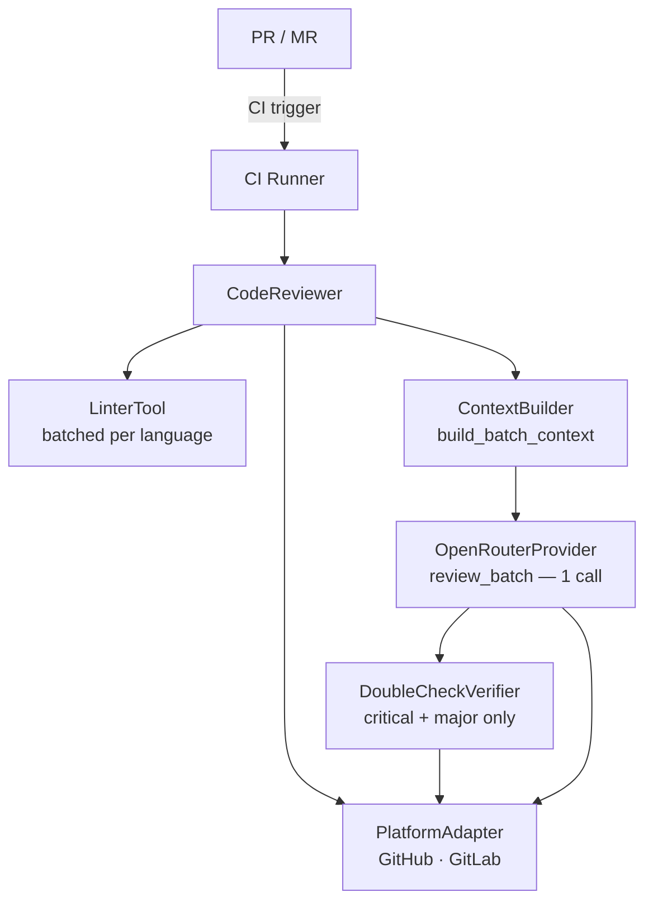

# Product Requirements Document: AI Code Reviewer

## Overview

| Field | Value |
| --- | --- |
| Product | AI Code Reviewer |
| Version | 3.0 (linter-first batch pipeline) |
| Last Updated | 2026-07-27 |
| Status | **Implemented — Active** |

## Executive Summary

AI Code Reviewer is an automated code review tool that integrates with GitHub Actions and GitLab CI/CD to provide intelligent, context-aware code reviews. It runs a linter pass first, then sends all changed files in a single AI call, and optionally runs a 2-pass verification for high-severity findings.

## Problem Statement

1. Manual code reviews are time-consuming and resource-intensive
2. Code quality varies across teams and projects
3. Security vulnerabilities and best-practice violations are often missed under review pressure
4. Small teams lack dedicated reviewers

**Target users:** Development teams (2–50 developers), solo developers, open-source maintainers.

## Implementation Status

### Core Features

#### Multi-Platform Support — Implemented

| Platform | Status |
| --- | --- |
| GitHub Actions — PR comments, API auth | Implemented |
| GitLab CI — MR discussions, API auth | Implemented |
| GitHub status checks / review approval | Not implemented |
| Bitbucket | Not planned |

#### Multi-Language Support — Implemented

All languages below are detected and have linter integration. The AI review also uses language-specific prompt context.

| Language | Linter | Fallback | Frameworks in Prompt |
| --- | --- | --- | --- |
| Python | pylint | flake8 | Django, Flask, FastAPI |
| JavaScript | eslint | — | React, Vue, Angular, Next.js |
| TypeScript | eslint | — | React, Next.js |
| Dart / Flutter | dart analyze | — | Flutter |
| Go | golangci-lint | go vet | Gin, Echo |
| Rust | cargo clippy | — | Actix, Rocket |
| Java | checkstyle | — | Spring |
| PHP | phpcs | php -l | Laravel |

#### Intelligent Context Analysis — Implemented

- Full file context (before/after changes via platform diff API)
- README content included in batch prompt (up to 3000 chars)
- Dockerfile/docker-compose content included
- Related file detection via import parsing
- Caller detection (files that import changed files)
- Changed symbol extraction (AST-based, functions/classes)

#### Configurable Review Rules — Implemented

Config file: `.ai-review-config.json` at repo root. All fields are optional — defaults apply if absent.

```json
{
  "enabled": true,
  "model": "z-ai/glm-4.5-air",
  "max_tokens": null,
  "temperature": 0.3,
  "exclusions": {
    "directories": ["node_modules", "vendor", "build"],
    "file_patterns": ["*.lock", "*.min.js"],
    "file_prefixes": ["test_"]
  },
  "cache_settings": {
    "cache_location": ".review_cache",
    "ttl_days": 7
  },
  "review_settings": {
    "severity_threshold": "minor",
    "max_comments_per_file": 10
  }
}
```

Note: `language_specific` block is parsed by config but not yet wired to specialized linter rules.

#### Smart Caching — Implemented

- MD5 cache key: `hash(filepath + diff + version_string)`
- File-backed storage with TTL expiration (default 7 days)
- Per-file granularity — one changed file doesn't bust cache for others
- Current version string: `v6-linter-first`

#### Batch AI Review — Implemented

All pending files (those that missed the cache) are sent in a single OpenRouter API call. The response is a JSON object with `comments` (array of inline findings) and `explainer` (markdown summary + understanding quiz). No per-file loop.

#### Linter-First Pass — Implemented

Before the AI call, language-specific linters run for all files grouped by language (one subprocess per language). Output is filtered to changed lines only and embedded in the batch prompt. This gives the AI static-analysis evidence alongside the diff.

#### 2-Pass Verification — Implemented

`DoubleCheckVerifier` runs on `critical` and `major` findings only:

1. Checks if cached linter output flagged the same line → `linter_confirmed: true/false`
2. Reads git history of the file (last 3 commits) for context
3. Reads related files mentioned in the issue text

Minor and suggestion findings bypass verification. No findings are removed — verification only adds metadata.

#### Explainer + Understanding Quiz — Implemented

A PR-level comment is posted (separate from inline comments) containing:

- Plain-language description of what changed
- Understanding quiz for reviewers

Only posted when the AI returns an `explainer` field in the batch response.

### AI Provider

| Provider | Status |
| --- | --- |
| OpenRouter (any hosted model) | Implemented |
| Anthropic direct API | Not implemented |
| OpenAI direct API | Not implemented |
| Self-hosted / Ollama | Not implemented |

Only OpenRouter is implemented. The `AIProviderAdapter` base class defines the interface for adding others.

### Not Yet Implemented

| Feature | Priority | Notes |
| --- | --- | --- |
| GitHub PR status checks | P1 | Adapter interface ready, not wired |
| Review modes (Quick/Deep/Security-only) | P2 | Would be config-driven prompt variants |
| Distributed cache (Redis) | P2 | CacheManager interface can be extended |
| Feedback loop / false-positive learning | P2 | No data collection currently |
| Analytics dashboard | P3 | No backend |
| Slack / Discord notifications | P3 | — |
| VSCode extension | P3 | — |
| Bitbucket support | Backlog | Needs PlatformAdapter implementation |

## Technical Architecture



Full pipeline: [FLOW.md](FLOW.md) | Module details: [ARCHITECTURE.md](ARCHITECTURE.md)

## Performance

| Metric | Target | Current Behaviour |
| --- | --- | --- |
| Review time (standard PR) | < 2 min | 1 AI call regardless of file count |
| API calls per PR | Minimize | 1 batch call + optional verify calls |
| Cache hit rate | > 60% | Per-file, version-keyed |
| Diff size limit | 10 000 chars | Files above this are skipped |

## Security Properties

- Credentials stored in CI environment variables only
- Config file (`.ai-review-config.json`) is excluded from review
- Code is sent to OpenRouter; no self-hosted option yet
- Linters run locally in the CI container

## Non-Functional Requirements

### Reliability

- Linter failures are non-fatal — review continues without linter data
- AI API failures skip affected files and log the error
- Cached results survive CI restarts within TTL window

### Scalability

- Single batch AI call scales linearly with context window (currently unlimited `max_tokens`)
- Linter batching keeps subprocess count to O(languages), not O(files)
- Files > 10 000 chars are skipped to stay within prompt budget

## Risk Assessment

| Risk | Impact | Mitigation |
| --- | --- | --- |
| AI provider cost on large PRs | Medium | Caching, diff size limit, batch pricing |
| False positives annoy reviewers | High | 2-pass verification, severity threshold config |
| Linter not installed in CI | Low | Graceful skip per language |
| OpenRouter outage | Medium | Error logged, review skipped; add retry |
| Context window exceeded | Low | `_pack_batches` splits if needed |

## Open Questions

1. Add GitHub PR status check integration?
2. Add a second AI provider (direct Anthropic) as fallback?
3. Should `language_specific` config keys drive actual linter rule selection?
4. Should verification be async/parallel across issues?
5. Add a `--dry-run` flag for local testing without posting?

## Glossary

- **PR** — Pull Request (GitHub)
- **MR** — Merge Request (GitLab)
- **Linter-first** — Static analysis runs before the AI call; output is embedded in the prompt
- **Batch review** — All pending files sent in one AI API call
- **2-pass verification** — Cross-checking AI findings against linter output and git history
- **Explainer** — PR-level markdown summary + quiz posted after inline comments
